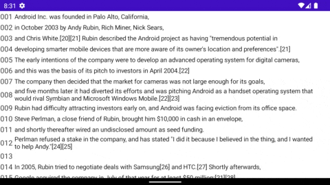

[](https://jitpack.io/#kaleidot725/text-editor-compose)
[](https://android-arsenal.com/api?level=24)
[](https://kotlinlang.org/)


<h1 align="center">
    Text Editor Compose
</h1>

<h3 align="center">
    A simple text editor for Jetpack Compose
</h3>

<h3 align="center">
    
</h3>

## Features

- [x] Edit multiple line text
- [x] Insert and delete newline
- [x] Get selected line index
- [x] Display line number
- [x] Copy multiple line
- [x] Delete multiple line
- [ ] Support physical keyboard

## Usage

This library is easy to use, just follow the steps below to add a dependency and write codes.

### Step 1: Add the JitPack repository to build.gradle

```groovy
allprojects {
	repositories {
		...
		maven { url 'https://jitpack.io' }
	}
}
```

### Step 2: Add the library to the dependencies

```groovy
dependencies {
	implementation 'com.github.kaleidot725:text-editor-compose:0.2.0'
}
```

### Step 3: Declare TextEditor & TextEditorState

```kotlin
class MainActivity : ComponentActivity() {
    override fun onCreate(savedInstanceState: Bundle?) {
        super.onCreate(savedInstanceState)
        setContent {
            SampleTheme {
                val textEditorState by rememberTextEditorState(lines = DemoText.lines())
                TextEditor(
                    textEditorState = textEditorState, 
                    onUpdatedState = { },              
                    modifier = Modifier.fillMaxSize() 
                )
            }
        }
    }
}
```

### Step 4: Customize row

```kotlin
class MainActivity : ComponentActivity() {
    override fun onCreate(savedInstanceState: Bundle?) {
        super.onCreate(savedInstanceState)
        setContent {
            SampleTheme {
                val textEditorState by rememberTextEditorState(lines = DemoText.lines())
                TextEditor(
                    textEditorState = textEditorState,
                    onUpdatedState = { },
                    modifier = Modifier.fillMaxSize(),
                    decorationBox = { index, isSelected, innerTextField ->
                        val backgroundColor = if (isSelected) Color(0x8000ff00) else Color.White
                        Row(modifier = Modifier.background(backgroundColor)) {
                            Text(text = (index + 1).toString().padStart(3, '0'))
                            Spacer(modifier = Modifier.width(4.dp))
                            innerTextField(modifier = Modifier.fillMaxWidth())
                        }
                    }
                )
            }
        }
    }
}
```

### Step 5: Create multiple selection menu

```kotlin
class MainActivity : ComponentActivity() {
    override fun onCreate(savedInstanceState: Bundle?) {
        super.onCreate(savedInstanceState)
        setContent {
            SampleTheme {
                val textEditorState by rememberTextEditorState(lines = DemoText.lines())
                TextEditor(
                    textEditorState = textEditorState,
                    onUpdatedState = { },
                    modifier = Modifier.fillMaxSize(),
                    decorationBox = { index, isSelected, innerTextField ->
                        val backgroundColor = if (isSelected) Color(0x8000ff00) else Color.White
                        Row(modifier = Modifier.background(backgroundColor)) {
                            Text(text = (index + 1).toString().padStart(3, '0'))
                            Spacer(modifier = Modifier.width(4.dp))
                            innerTextField(modifier = Modifier.fillMaxWidth())
                        }
                    }
                )
            }
        }
    }
}

@Composable
private fun ColumnScope.TextEditorMenu(textEditorState: TextEditorState) {
    val context: Context = LocalContext.current
    val clipboardManager: ClipboardManager = LocalClipboardManager.current

    Row(modifier = Modifier.padding(8.dp)) {
        Text(
            text = "Enable multiple selection mode",
            modifier = Modifier
                .weight(0.9f, true)
                .align(Alignment.CenterVertically)
        )
        Switch(
            checked = textEditorState.isMultipleSelectionMode.value,
            onCheckedChange = {
                textEditorState.enableMultipleSelectionMode(
                    !textEditorState.isMultipleSelectionMode.value
                )
            }
        )
    }

    Row(modifier = Modifier.padding(8.dp)) {
        Text(
            text = "Copy selected lines",
            modifier = Modifier
                .weight(0.9f, true)
                .align(Alignment.CenterVertically)
        )
        Button(
            onClick = {
                val text = textEditorState.getSelectedText()
                textEditorState.enableMultipleSelectionMode(false)

                clipboardManager.setText(AnnotatedString(text))
                Toast.makeText(context, "Copy selected text to clipboard", Toast.LENGTH_SHORT).show()
            }
        ) {
            Text(text = "EXECUTE")
        }
    }
    
    Row(modifier = Modifier.padding(8.dp)) {
        Text(
            text = "Delete selected lines",
            modifier = Modifier
                .weight(0.9f, true)
                .align(Alignment.CenterVertically)
        )
        Button(onClick = {
            textEditorState.deleteSelectedLines()
            textEditorState.enableMultipleSelectionMode(false)
        }) {
            Text(text = "EXECUTE")
        }
    }
}
```

## Demo

### Edit multiple line text


### Insert and delete newline


### Get selected line index



### Display line number


### Copy multiple line


### Delete multiple line


